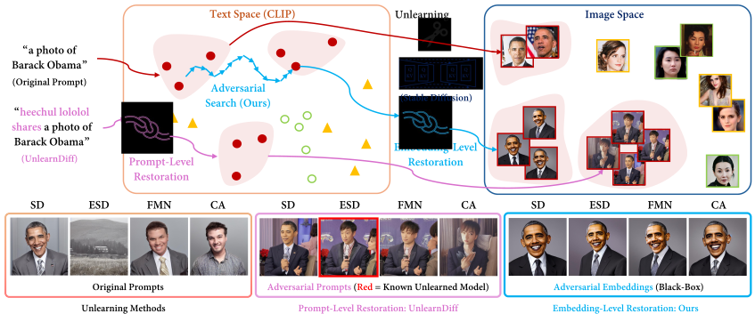

# Probing Unlearned Diffusion Models: A Transferable Adversarial Attack Perspective [\[arXiv\]](http://arxiv.org/abs/2404.19382)

This repository contains the official implementation of the paper titled "**P**robing **Un**learned **D**iffusion Models: A Transferable Adversarial Attack Perspective".



## Environment

This project is developed with Python 3.9. Please run the following script to install the required packages.

```
pip install -r requirements.txt
```

## Preparation

The original weight for Stable Diffusion (SD) v1.4 can be downloaded from [here](https://huggingface.co/CompVis/stable-diffusion-v-1-4-original/resolve/main/sd-v1-4.ckpt?download=true) and placed at `stable-diffusion/models/ldm/stable-diffusion-v1/sd-v1-4.ckpt`.

We use the Diffusers version of the SD model and require converting the original CompVis version to the Diffusers format by executing:

```
python stable-diffusion/train-scripts/compvis2diffusers.py
```

Additionally, download the following modules: `vae`, `tokenizer`, and `text_encoder` from [here](https://huggingface.co/CompVis/stable-diffusion-v1-4/tree/main), and place them in the folder `stable-diffusion/diffusers_ckpt/ORI`.

We provide unlearned model checkpoints for object (e.g., *Jeep*) and ID (e.g., *Angelina Jolie*), which are placed in the folder `stable-diffusion/diffusers_ckpt`. The download links are provided in the table below:

| UCE                                                           | ESD                                                           | FMN                                                           | CA                                                            |
| ------------------------------------------------------------- | ------------------------------------------------------------- | ------------------------------------------------------------- | ------------------------------------------------------------- |
| [ckpt](https://pan.baidu.com/s/13OpalnsTpSl3Z-DSEVoXhg?pwd=e8j4) | [ckpt](https://pan.baidu.com/s/1T_BS0ycz84_243sXX-d25w?pwd=drcr) | [ckpt](https://pan.baidu.com/s/1INsz-5n2gGQNXpjCzQzjrg?pwd=28hw) | [ckpt](https://pan.baidu.com/s/1UzWxZ7EGL9WsaLXDrPhIDA?pwd=ieyu) |

For ID evaluation, we integrate [celeb-detection-oss](https://github.com/Giphy/celeb-detection-oss) into our code. Please download the facial recognition model weight from [here](https://pan.baidu.com/s/1bOEO6Fkyd6QEuT9EI3WnmA?pwd=0kz8) and place it in the folder `src/tasks/utils/metrics/celeb-detection-oss/examples/resources/face_recognition`.

## Generate training data for restoration

Taking the restoration of *Angelina Jolie* as an example, we first generate images of Angelina Jolie using the original Stable Diffusion (SD). The csv file containing the prompts for image generation is placed in the `prompts` folder. Generate images by running:

```
python src/execs/generate_dataset.py --prompts_path prompts/id/jolie.csv --concept jolie --save_path files/dataset/id --device cuda:0
```

(Optional but recommended): Use the classifiers to choose the good generated images for embedding search by running:
 
 ```
 python src/execs/choose_dataset.py --concept_type 'id' --concept 'angelina jolie' --threshold 0.99
 ```

## Search for the embedding

The configuration files for search are located in the `configs` folder. Start the adversarial search by running:

```
python src/execs/attack.py --config-file configs/id/jolie/ORI_jolie.json --logger.name Adv_Search
```

To validate the obtained embedding, we feed it into the unlearned model (`task.erase_ckpt` in the configuration file) to generate the image. We chooose the embedding based on its performance on the unlearned model (we use the UCE erased model for validation in the experiments).

## Test the obtained embedding

We provide adversarial embeddings for the restoration of object (e.g., *Jeep*) and ID (e.g., *Angelina Jolie*) in the folder `files/embeddings`. The test demonstration is available in `test.ipynb`.

## Acknowledgment

This repository is built upon the official codebase of [UnlearnDiff](https://github.com/OPTML-Group/Diffusion-MU-Attack), and we express gratitude for their helpful contributions.

## Citation

```
@misc{han2024probing,
      title={Probing Unlearned Diffusion Models: A Transferable Adversarial Attack Perspective}, 
      author={Xiaoxuan Han and Songlin Yang and Wei Wang and Yang Li and Jing Dong},
      year={2024},
      eprint={2404.19382},
      archivePrefix={arXiv},
      primaryClass={cs.CV}
}
```